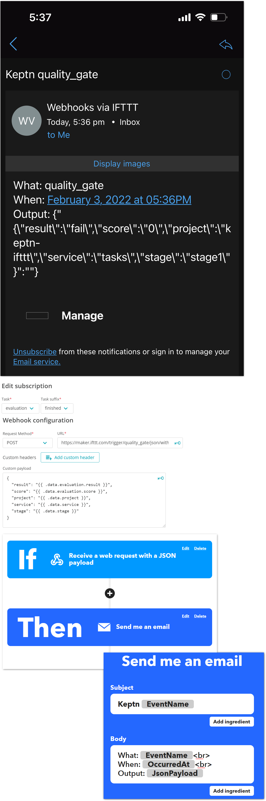

# IFTTT Integration with Keptn



Keptn can be integrated with IFTTT by using the webhook-service. This integrations means any IFTTT applet can be executed.

```
If This = Incoming Webhook [with JSON payload (optional)]
Then That = A third party service
```

## Example: Receive an Email on each Quality Gate Evaluation

1. Create a new applet on IFTTT
2. On IFTTT.com: Set the `If` condition to a webhook (optionally with input data)
3. Note your IFTTT URL which should look like:

```
https://maker.ifttt.com/trigger/{event_name}/json/with/key/{ifttt_secret_key}
```
4. Use the Keptn `webhook service` and subscribe to the `evalution.finished` event
5. Set the custom payload as follows:

```
{
  "result": "{{ .data.evaluation.result }}",
  "score": "{{ .data.evaluation.score }}",
  "project": "{{ .data.project }}",
  "service": "{{ .data.project }}",
  "stage": "{{ .data.project }}"
}
```
6. On IFTTT.com: Set the `Then` condition to be "Send me an email"
7. Customise the subject and body to your liking. Use the `{{ JsonPayload }}` placeholder to receive the payload from Keptn.

## Trigger an Evaluation
Trigger a new Keptn evaluation and to test the integration.