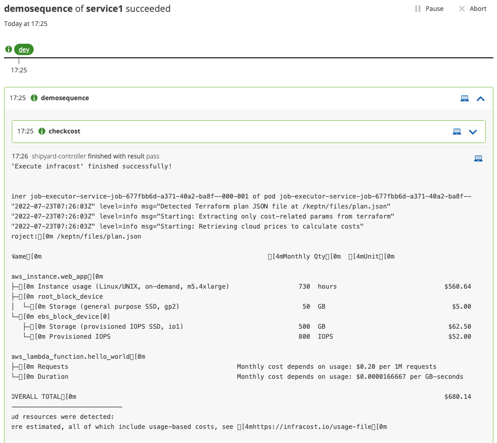

# Infracost Integration with Keptn



This integration uses the [job executor service](https://github.com/keptn-contrib/job-executor-service).

## Prerequisites

You will need:

- An infracost API token (see [get an API token](https://www.infracost.io/docs/#2-get-api-key))

## How it Works
The Job executor service is configured to listen for a `sh.keptn.event.{task}.triggered` event (if following the example files, this is `sh.keptn.event.checkcost.triggered`).

The job executor:
1. Creates a new Kubernetes job
2. Copies in the Terrafrom plan.json file from the Keptn git repo at `/files/plan.json` into the container at `/keptn/files/plan.json`.
3. Reads the `infracost-details` secret and sets the `INFRACOST_API_TOKEN` environment variable
4. Sends an `sh.keptn.event.checkcost.started` event to Keptn
5. Runs `infracost breakdown --path /keptn/files/plan.json --format table`
6. Sends an `sh.keptn.event.checkcost.finished` event to Keptn, with the tabular output

## Install Job Executor Service
Follow the [Job executor service install instructions](https://github.com/keptn-contrib/job-executor-service#quickstart) to install on a cluster (either local to Keptn control plane components or on a different cluster).

Ensure the Job Executor Service is installed listening for the `sh.keptn.event.taskname.triggered` event that corresponds to your Shipyard file (see below).

Below, the task is `checkcost` so JES should listen for `sh.keptn.event.checkcost.triggered`.

Create a Kubernetes secret in the same namespace.

- The name (`infracost-details`) can be changed but must match what you use in `job/config.yaml` (see later).
- The key `INFRACOST_API_KEY` **cannot** be changed as infracost relies on exactly this as an environment variable.

```
kubectl -n YOUR_NAMESPACE create secret generic infracost-details \
--from-literal=INFRACOST_API_KEY=YOUR_INFRACOST_API_KEY
```

## Add Necessary Files
In your Git upstream, add the following files to your stage branch (eg. `dev`). These should be placed inside the service folder.

For example: `service1/job/config.yaml` on the `dev` branch.

- [Job Executor Config File](https://github.com/agardnerIT/keptninfracost2/blob/dev/service1/job/config.yaml)
- [Terraform plan.json file](https://github.com/agardnerIT/keptninfracost2/blob/dev/service1/files/plan.json)

## Example Shipyard

[Here is an example Shipyard file.](https://github.com/agardnerIT/keptninfracost2/blob/master/shipyard.yaml)
```
apiVersion: "spec.keptn.sh/0.2.2"
kind: "Shipyard"
metadata:
  name: "infracost-shipyard"
spec:
  stages:
    - name: "dev"
      sequences:
        - name: "demosequence"
          tasks:
            - name: "checkcost"
```