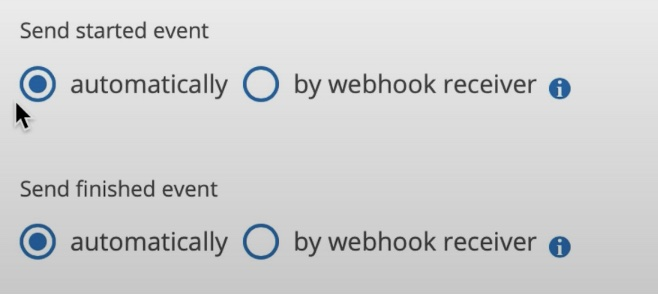
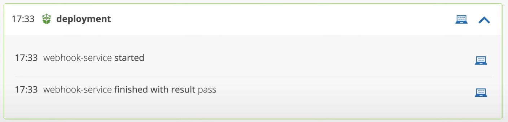
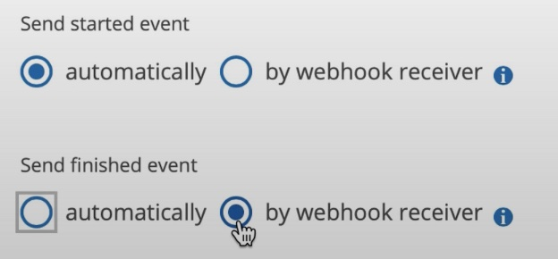
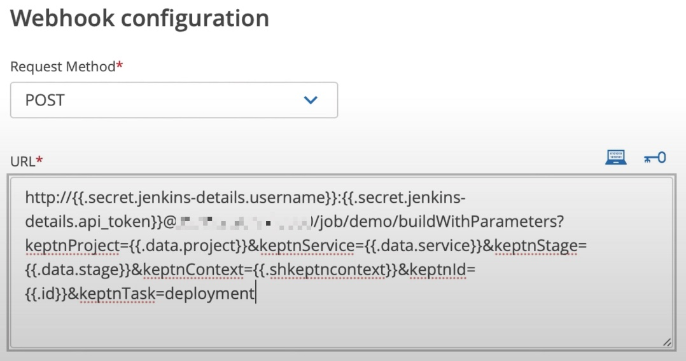
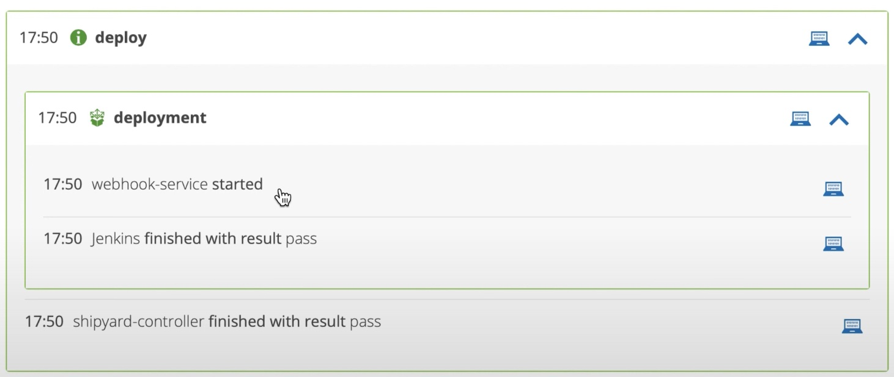

# Jenkins Webhook Integration

- Using older Keptn version 0.10.x, 0.11.x and 0.12.x? Use the [Keptn Jenkins Shared Library](https://artifacthub.io/packages/keptn/keptn-integrations/jenkins-library).
- Using a Keptn version above 0.12.x? Use this integration method.

Keptn versions 0.12.x and newer include a webhook capability. Use this to trigger Jenkins either asynchronously with no changes required to your Jenkins job, or synchronously with one change to the job.

## Video Explanation & Demo

This video explains both asynchronous and synchronous methods:

[](https://www.youtube.com/watch?v=ehI23d7s-dY&t=50s)

## Asynchronously Trigger Jenkins
In the bridge, navigate to a project and go to the Settings > Integrations page.

Select the webhook service and click the `+ Add subscription` button.

When configuring the webhook, set both `Send started event` and `Send finished event` to `automatically`.



Craft the webhook to `POST` to the Jenkins `/build` endpoint (see [Jenkins docs](https://www.jenkins.io/doc/book/using/remote-access-api/) for more info).

With these settings, the Keptn `taskName.started` and `taskName.finished` event will be automatically and immediately generated and sent when the webhook is triggered.

The result is that Jenkins is triggered asynchronously.

The task will look like this:



## Synchronously Trigger Jenkins

In the bridge, navigate to a project and go to the Settings > Integrations page.

Select the webhook service and click the `+ Add subscription` button.

When configuring the webhook, set `Send started event` to `automatically`. Set `Send finished event` to `by webhook receiver`.



With these settings, the webhook service will automatically generate and send a `taskName.started` event back to Keptn when the webhook is fired. Before progressing, Keptn will then wait for a corresponding `taskName.finished` task which must be generated by Jenkins and sent from Jenkins back to Keptn.

Should Jenkins fail to send the `taskName.finished` event, the task will never end.

1. Store the Keptn API token as a Jenkins credential
2. Parameterise the Jenkins build
3. Trigger the job using `/buildWithParameters` endpoint
4. On triggering a job, send important Keptn parameters to Jenkins as Job parameters (see below)
5. (optional) Use build parameters sent above to send `taskName.status.changed` events during execution
6. Use build parameters sent above to craft a `taskName.finished` event and send to Keptn

### Jenkins Build Parameters
Parameterise the Jenkins job and add the following parameters:

1. `keptnProject`, `keptnService` and `keptnStage`
2. `keptnContext` and `keptnId`
3. `keptnTask`

### Craft Webhook Requests

The URL should be a POST and look something like this:

```
https://myJenkins.com/job/JobName/buildWithParameters?keptnProject={{.data.project}}&keptnService={{.data.service}}&keptnStage={{.data.stage}}&keptnContext={{.shkeptncontext}}&keptnId={{.id}}&keptnTask=<YourTaskName>
```



Items in double curly brackets are variables which will be pulled from the `taskName.triggered` CloudEvent and replaced at runtime.

These parameters are required so you can build a `taskName.finished` event when the job has finished.

Sending one or more `taskName.status.changed` event(s) **during** execution is also possible. Adjust the example below so the `type` is `sh.keptn.event.<taskName>.status.changed` rather than `sh.keptn.event.<taskName>.finished`.

### Sample Pipeline

```
pipeline {
    agent any

    stages {
        stage('Hello') {
            steps {
                
                echo 'Hello World'
                sleep 10
                
                withCredentials([string(credentialsId: 'keptn-api-token', variable: 'KEPTN_API_TOKEN')]) {
                  sh """
                    curl -X POST http://myKeptn.com/api/v1/event \
                    -H 'x-token: ${KEPTN_API_TOKEN}' \
                    -H 'Content-Type: application/json' \
                    --data-raw '{
                                "specversion": "1.0",
                                "source": "Jenkins",
                                "shkeptncontext": "${params.keptnContext}",
                                "triggeredid": "${params.keptnId}",
                                "type": "sh.keptn.event.${params.keptnTask}.finished",
                                "contenttype": "application/json",
                                "data": {
                                           "project": "${params.keptnProject}",
                                           "service": "${params.keptnService}",
                                           "stage": "${params.keptnStage}",
                                           "status": "succeeded",
                                           "result": "pass"
                                        }
                              }'
                  """
                } // end with creds
            } // end steps
        } // end stage
}
```

The Keptn task will look like this where the webhook signals the start of the task and Jenkins signals its completion.


