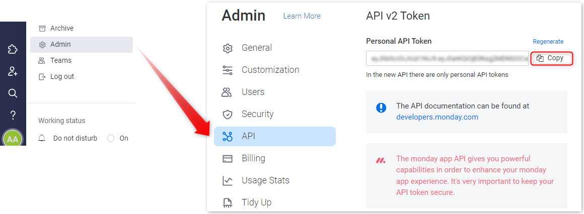
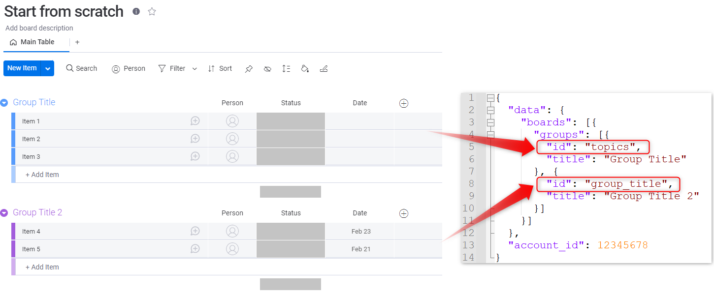

# Monday.com Integration

Create Monday.com Items from Keptn

## Step 1: Gather Monday.com Details
1. Go to Monday.com and copy your Personal API token. "User Circle Icon" > Admin > API
  


2. Go to your board and make a note of the board ID from the url:


3. Each "group" of items in the UI has a unique ID.
Use the Monday API to get the `id` of the group where you want to create items.

```
MONDAY_API_TOKEN=<YOUR-API-TOKEN>
MONDAY_BOARD_ID=<YOUR-BOARD-ID>
curl --location --request POST "https://api.monday.com/v2" \
--header "Authorization: $MONDAY_API_TOKEN" \
--header "Content-Type: application/json" \
--data-raw "{\"query\":\"query { boards (ids: $MONDAY_BOARD_ID) { groups { id title}} }\",\"variables\":{}}"
```

The output should look like this. Here you need to use either `topics` and `group_title`.
```
{ "data":{
    "boards":[{
      "groups":[{
        "id":"topics",
        "title":"Group Title"
      }, {
        "id":"group_title",
        "title":"Group Title 2"
      }]
    }]
  },
  "account_id":12345678
}
```



## Step 2: Save Secrets
Save each of the items above into a Keptn secret making sure to set the `scope` as `keptn-webhook-service`


## Step 3: Configure Webhook

1. Subscribe to whatever task and task suffix you wish
2. Set the Request Method to `POST`
3. Set the URL as: `https://api.monday.com/v2`
4. Add 2 headers: `Authorization` and `Content-Type`
5. Set `Content-Type` header to `application/json`
6. Set `Authorization` to your Monday.com API token (eg. `{{.secret.monday-details.api_token}}`)
7. Set the body as below:

```
{
"query": "mutation {create_item(board_id: <YOUR-BOARD-ID>, group_id: <YOUR-GROUP-IP>, item_name: \"My Item Title Here...\") { id }}",
"variables": {}
}
```

For example:

```
{
  "query": "mutation {create_item(board_id: {{.secret.monday-details.board_id}}, group_id: {{.secret.monday-details.group_id}}, item_name: \"My Item Title Here...\") { id }}",
  "variables": {}
}
```


## Output
Your Monday.com item will be created. You can also use variables from the previous Keptn events such as the project `{{ .data.project }}`, service `{{ .data.service }}`, stage `{{ .data.stage }}` or any other content you need to send to Monday.com (such as quality gate evalution results).

