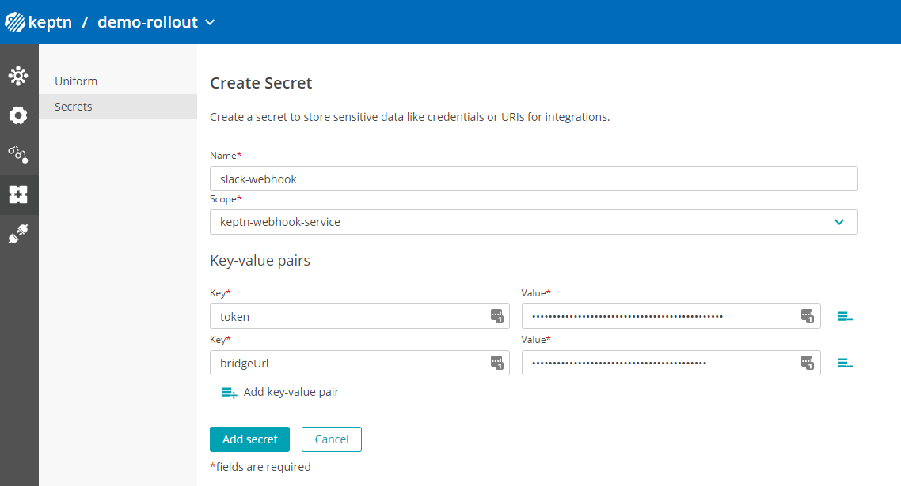

# Slack Notifications via Keptn Webhooks

This integration shows you how to send notifications to Slack leveraging [Keptn's Webhook Service](https://keptn.sh/docs/0.10.x/integrations/webhooks/).

[WATCH THIS VIDEO TUTORIAL](https://www.youtube.com/watch?v=0vJS7ecayGw&t=7s) to see this in action!

Here is a quick overview of how those messages in Slack can look like (message content and format can be customized):


## Prerequisites

### Step 1: Enable Incoming Webhooks in Slack

In Slack please follow the guidelines to enable [Incoming webhooks](https://api.slack.com/messaging/webhooks).

### Step 2: Configure your Slack Incoming Webhook URL

Now configure your incoming webhook and obtain your webhook URL. The URL contains a unique part that is specific to your webhook, e.g:
```
https://hooks.slack.com/services/AAAAAAAAAAA/BBBBBBBBBB/cccccccccccccccccccccc
```

What we will later do is store that unique secret part in a Keptn secret so we don't end up storing this in the configuration repo.

### Step 3: Create Slack Channels to push notifications to

In our example we assume you have slack channels with the name pattern PROJECT--SERVICE where PROJECT refers to the Keptn Project Name and SERVICE to the Service Name in your Keptn project. You can change this however if you want to by customizing the JSON Payload to the Slack Webhook.

### Step 3: Validate you have Keptn Webhook Service deployed

Keptn Webhook Service was introduced with Keptn 0.10.0 and is getting installed by default on Keptn's control plane. In case you manually installed Keptn or upgraded manually please validate and ensure that your Keptn installation runs Keptn's webhook service

## Configure Keptn Webhooks for Slack

### Step 1: Create Keptn Secret for Slack

In Keptn select a project then click on **Uniform** -> **Secrets**
Then create a new secret with the following values.
```
Name: slack-webhook
Scope: keptn-webhook-service
```
And the following two Key-value pairs:
```
token: AAAAAAAAAAA/BBBBBBBBBB/cccccccccccccccccccccc
bridgeUrl: https://yourkeptnURL
```

For reference - here is a screenshot of that secret


### Step 2: Subscribe to a Keptn event to push notifications to Slack

In Keptn navigate to **Uniform** -> **Uniform** and there select the **webhook-service**
From here you can now create a new event subscription on the current selected project.

**Example 1: Evaluation Finished Notifications**

In the *Create subscription* form section fill out the following fields:
```
Task: evaluation
Task suffix: finished
```

In the *Webhook configuration* form section fill out the following:
```
Request Method: POST
URL: https://hooks.slack.com/services/{{.secret.slack-webhook.token}}
Payload:
payload={ 
  "channel" : "{{.data.project}}--{{.data.service}}",
  "username" : "keptn", 
  "blocks": [
    {
      "type" : "section",
      "text" : {
        "type": "mrkdwn",
        "text" : "*Keptn Evaluation finished:* {{.data.result}} ({{.data.evaluation.score}} / 100)"
      }
    },
    {
      "type" : "section",
      "text" : {
        "type": "mrkdwn",
        "text" : "*Project:* {{.data.project}}\n*Stage:* {{.data.stage}}\n*Service:* {{.data.service}}\n*Details:* {{.secret.slack-webhook.bridgeUrl}}/bridge/evaluation/{{.shkeptncontext}}"
      }
    }
  ]
}
```

Here is a screenshot for your reference:


**Example 2: Deployment Finished Notifications**

And here now an example for sending a deployment finished event. 

In the *Create subscription* form section fill out the following fields:
```
Task: evaluation
Task suffix: finished
```

In the *Webhook configuration* form section fill out the following:
```
Request Method: POST
URL: https://hooks.slack.com/services/{{.secret.slack-webhook.token}}
Payload:
payload={
  "channel" : "{{.data.project}}--{{.data.service}}",
  "username" : "keptn", 
  "blocks": [
    {
      "type" : "section",
      "text" : {
        "type": "mrkdwn",
        "text" : "*Keptn Deployment finished:* {{.data.result}}"
      }
    },
    {
      "type" : "section",
      "text" : {
        "type": "mrkdwn",
        "text" : "*Project:* {{.data.project}}\n*Stage:* {{.data.stage}}\n*Service:* {{.data.service}}\n*URL:* {{index .data.deployment.deploymentURIsPublic 0}}\n*Details:* {{.secret.slack-webhook.bridgeUrl}}/trace/{{.shkeptncontext}}"
      }
    }
  ]
}
```

## Feedback

If you have any feedback or additional examples please let us know. Best way is to either leave a comment on this Git repo, do a PR or join our conversation in the [Keptn Slack Channel](https://slack.keptn.sh)