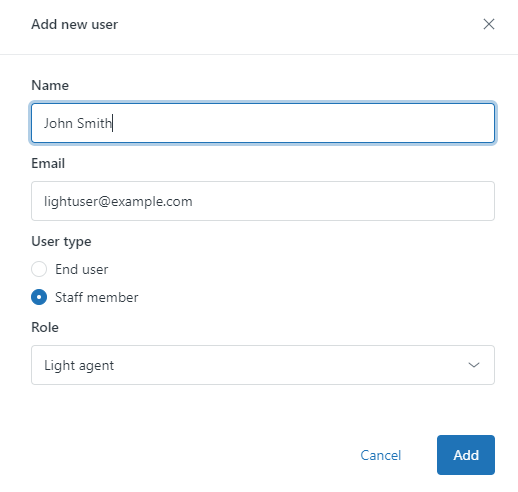
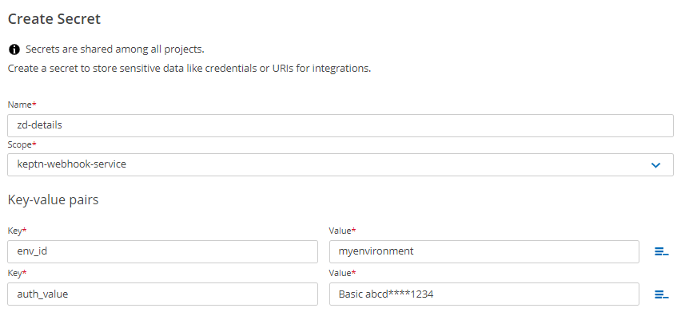
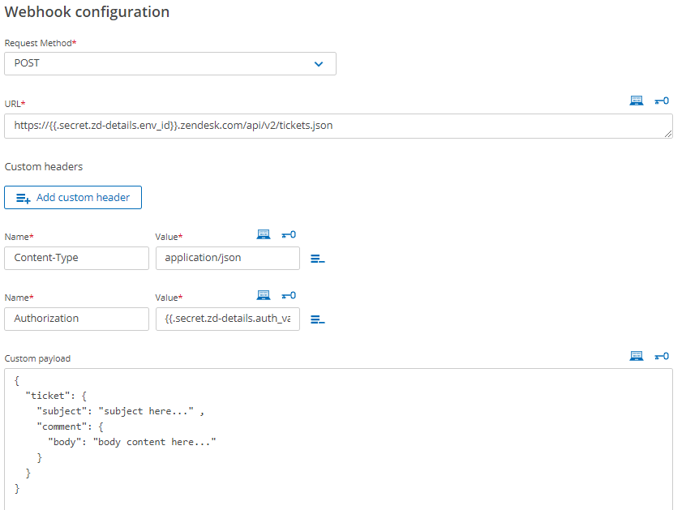
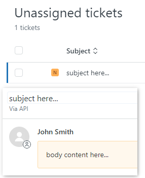

  # Keptn Zendesk Integration

  Create Zendesk tickets directly from Keptn.
  
  ## Step 1: Gather Zendesk Details
  1. Make a note of your Zendesk environment ID: `myenvironment` in `https://myenvironment.zendesk.com`
  2. Generate an API token. Do so at: `https://myenvironment.zendesk.com/agent/admin/api/settings`
  3. Make a note of the email address of a User or Light user you wish to create tickets from Keptn: eg. `lightuser@example.com`
    
  

  ## Step 2: Encode Basic Authentication String

  1. Append `/token` (this string, not the token value) to the end of the email address: eg. `lightuser@example.com/token`
  2. Create a string in the Basic authentication syntax `username:api_token` eg. `lightuser@example.com/token:YOUR_API_TOKEN`
  3. Base64 encode that string. Output example: `abcd****1234`
  4. Add `Basic ` to the beginning of that string so it looks like this: `Basic abcd****1234`.

  This page will refer to this string as `auth_value`

  ## Step 3: Store Keptn Secret
  Store the above details in a Keptn secret that has `keptn-webhook-service` permissions:

  

  ## Step 4: Create Keptn Webhook Subscription

  This is the `curl` request to recreate:

  ```
  curl -X POST https://myenvironment.zendesk.com/api/v2/tickets.json \
    -H "Content-Type: application/json" \
    -H "Authorization": "Basic abcd****1234" \
    --data '{
        "ticket": {
          "subject": "subject here..." ,
          "comment": {
            "body": "body content here..."
          }
        }
      }'
  ```
  

  ## Step 5: See Ticket Output

  Execute a sequence and you should receive a new Zendesk ticket.

  

